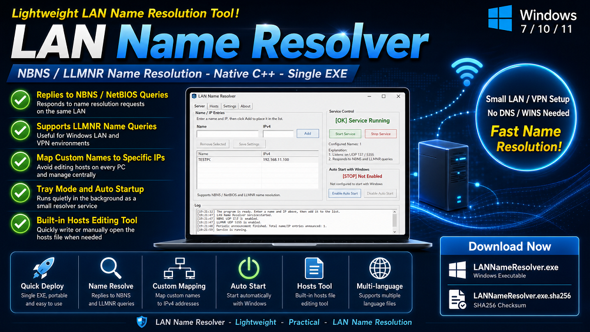
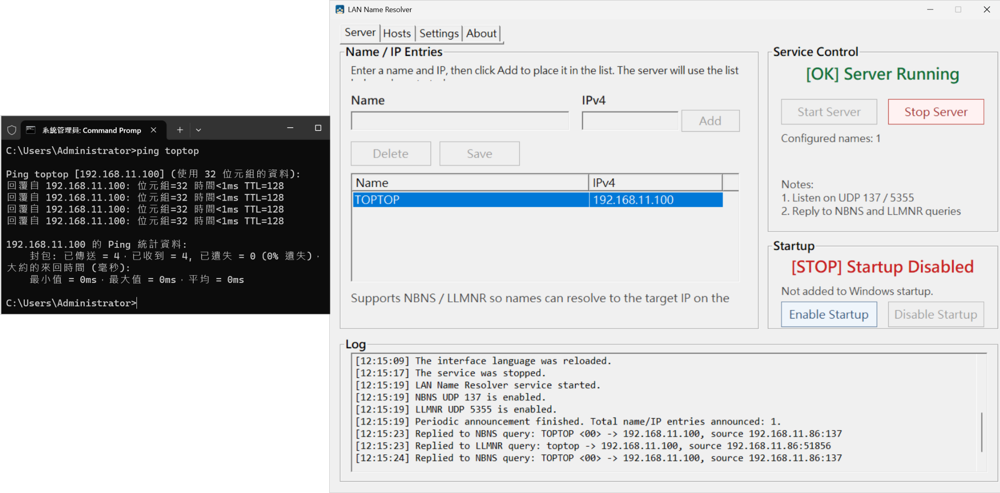
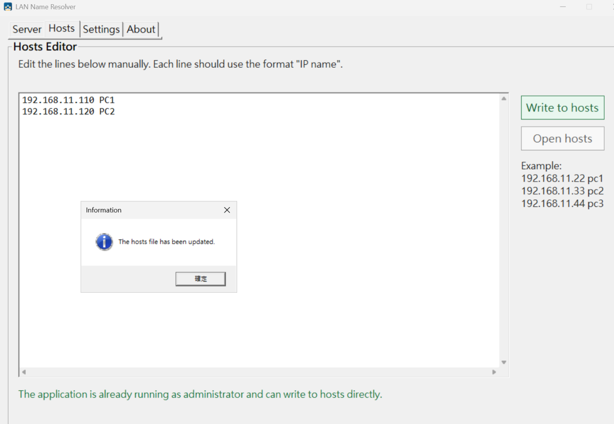
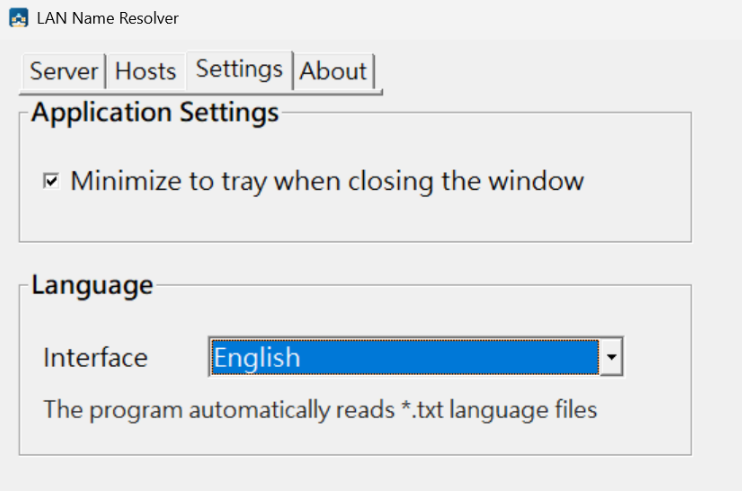
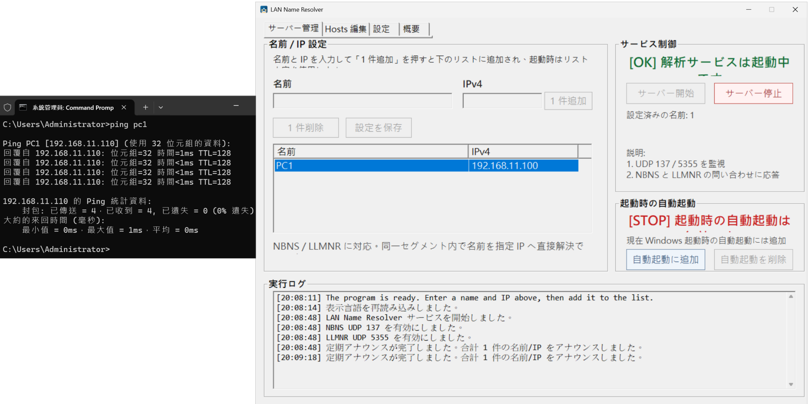
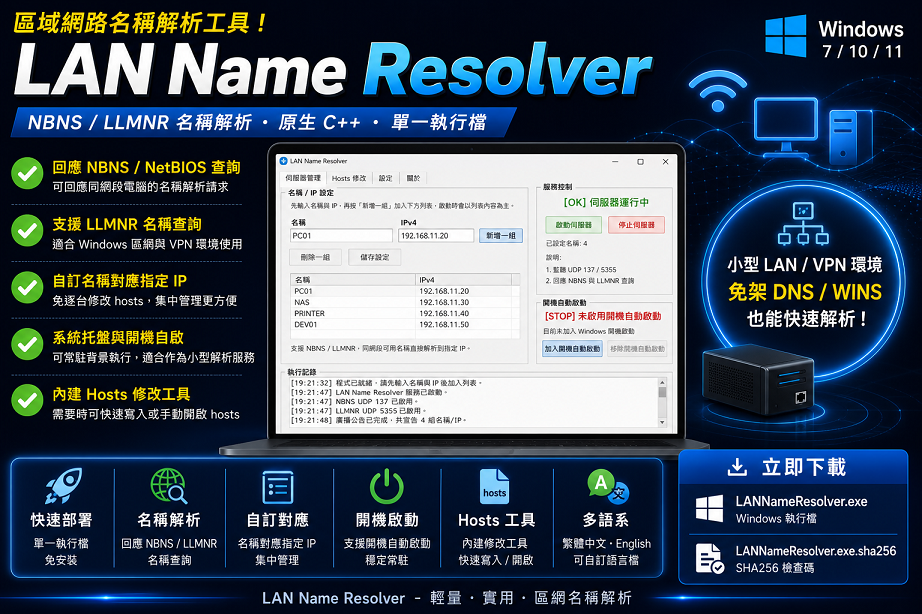
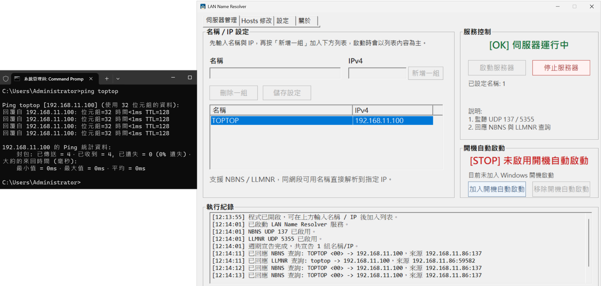
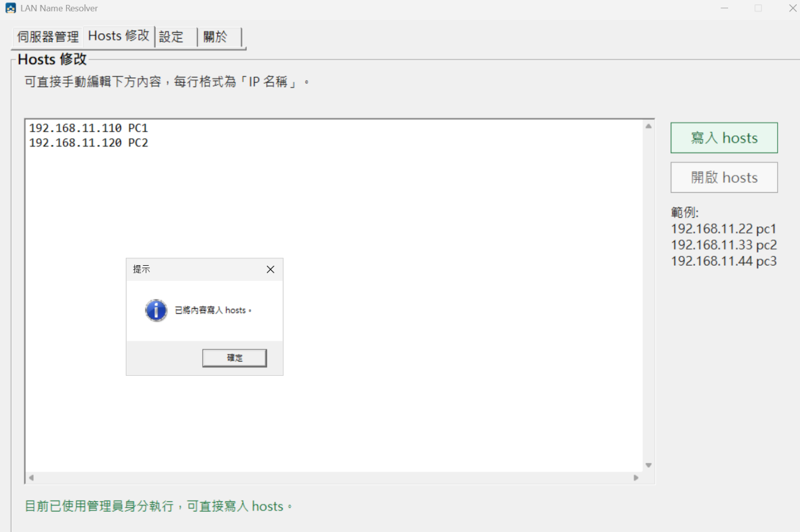
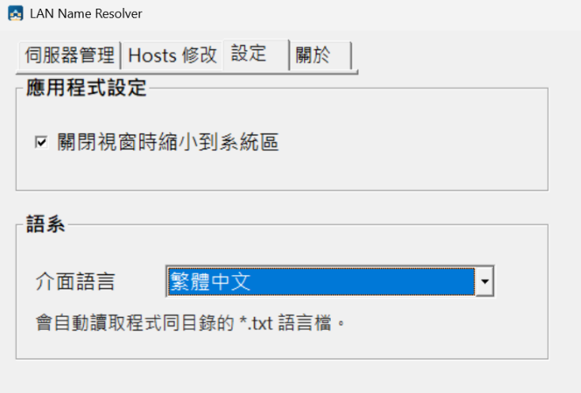

# LAN Name Resolver

A lightweight Windows LAN name resolver that provides NBNS / LLMNR responses and optional hosts management for local network maintenance.


[Releases](https://github.com/Terence0816/LAN-Name-Resolver/releases) |
[Latest Release v1.0](https://github.com/Terence0816/LAN-Name-Resolver/releases/tag/v1.0) |
[Apache License 2.0](LICENSE)

English | [繁體中文](#繁體中文)

---

## English



## Version History

### v1.0

Initial public release.

* Added NBNS / NetBIOS-style name query response support.
* Added LLMNR name query response support.
* Added custom name / IPv4 mapping.
* Added multiple name / IP entry support.
* Added optional hosts editor.
* Added system tray support.
* Added startup with Windows support.
* Added external `.txt` language file support.
* Tested custom Japanese interface through language file.


## What is LAN Name Resolver?

LAN Name Resolver is a lightweight Windows LAN name resolver tool written in native Win32 C++.

It can respond to local network name resolution queries and map custom host names to specified IPv4 addresses.

Instead of manually editing the hosts file on every computer, you can run this tool as a simple local name resolver and allow other computers on the same network to resolve names such as:

```text
\\pcname
```

instead of only using:

```text
\\192.168.11.100
```

This is useful for LAN, VPN, maintenance, deployment, testing, and temporary network environments where setting up a full DNS or WINS server is unnecessary.

---

## Main Features

* Responds to NBNS / NetBIOS-style name queries.
* Responds to LLMNR name queries.
* Maps custom host names to specified IPv4 addresses.
* Supports multiple name / IP entries.
* Can reduce the need to manually edit hosts files on multiple computers.
* Includes an optional hosts editor for simple local hosts file management.
* Can import configured name / IP entries into the hosts editor.
* Supports system tray operation.
* Supports startup with Windows.
* Supports external `.txt` language files.
* Built-in Traditional Chinese and English interface.
* Custom language file support, tested with Japanese interface.

---

## Screenshots

### Server Management

The server page allows you to add custom name / IP mappings and start the resolver service.



### Hosts Editor

If you only want to modify the local hosts file, you can use the built-in hosts editor without running the resolver service.



### Language Settings

LAN Name Resolver supports built-in language switching and external custom `.txt` language files.



### Custom Japanese Language Example

The interface can be extended with a custom language file.
This screenshot demonstrates a Japanese language file loaded through the custom language option.



---

## Suitable Use Cases

* VPN environments where users need to connect to internal computers by name, such as `\\pcname`, instead of only using IP addresses.
* Small LAN environments without a dedicated DNS or WINS server.
* Maintenance networks where temporary name resolution is needed.
* Devices that only have an IP address but no easy-to-remember host name.
* Offices, workshops, or repair environments where multiple computers would otherwise need manual hosts file changes.
* Legacy or mixed Windows environments that still rely on NBNS / LLMNR name resolution.
* Temporary network setups for repair, deployment, testing, or troubleshooting.
* Simple local hosts editing when you do not want to run the resolver service.

---

## Why use this tool?

In some environments, multiple computers or devices need to be accessed by name.

Normally, you may need to edit the hosts file on every computer manually. This quickly becomes inconvenient when there are many computers or when IP addresses change.

LAN Name Resolver provides another option:

* Add the host name and IP address once.
* Start the resolver service.
* Other computers in the same network can resolve the configured name through NBNS / LLMNR.
* No need to manually modify hosts on every computer.

For simple single-computer use, the built-in hosts editor can also be used without running the resolver service.

---

## Hosts Management

LAN Name Resolver includes a simple hosts management tool.

You can manually edit hosts entries in the format:

```text
192.168.11.100 TEST5
192.168.11.2 pc1
192.168.11.3 pc2
```

This is useful when you only want to modify the local hosts file and do not need to run the NBNS / LLMNR resolver service.

The hosts file is modified only when the user manually clicks the write button.

---

## Language Files

LAN Name Resolver supports external `.txt` language files.

The program can automatically read language files placed in the same directory as the executable.

This makes it possible to create additional interface languages without modifying the program source code.

A Japanese custom language file has been tested as an example.

---

## Network Ports

The resolver service may use the following UDP ports:

```text
UDP 137   NBNS / NetBIOS Name Service
UDP 5355  LLMNR
```

If one of the ports is occupied or restricted by the system, the program will continue with other available name resolution methods when possible.

---

## Windows 7 LLMNR Note

On Windows 7, UDP 5355 may already be occupied by the system LLMNR service or may be blocked due to permission restrictions.

If LLMNR cannot be started, LAN Name Resolver will continue running with other available name resolution methods, such as NBNS / NetBIOS name resolution.

---

## Security Notice

This tool listens on UDP 137 and UDP 5355 to respond to LAN name resolution queries.

It may also modify the Windows hosts file only when requested by the user through the hosts editor.

Please use this tool only in your own LAN, maintenance environment, VPN environment, or other authorized network environment.

This tool is intended for local network maintenance and name resolution convenience. It is not designed for unauthorized network spoofing, phishing, or malicious redirection.

---

## Notes

* Designed for Windows 7 / Windows 10 / Windows 11.
* IPv4 is currently supported.
* Host names should normally be short ASCII names.
* NetBIOS names are limited to 15 characters.
* If LLMNR or NetBIOS is disabled by Group Policy or system settings, name resolution may not work in that environment.
* If your organization already uses DNS, Active Directory, or WINS, those systems should usually be preferred for production networks.
* Administrator privileges may be required for hosts file modification and some network operations.

---

## Download

Download the latest release from:

[LAN Name Resolver Releases](https://github.com/Terence0816/LAN-Name-Resolver/releases)

Release files may include:

```text
LANNameResolver.exe
LANNameResolver.exe.sha256
```

---

# 繁體中文



## 版本紀錄

### v1.0

初始公開版本。

* 新增 NBNS / NetBIOS 風格名稱查詢回應功能。
* 新增 LLMNR 名稱查詢回應功能。
* 新增自訂名稱 / IPv4 對應功能。
* 新增多組名稱 / IP 設定功能。
* 新增選用的 hosts 修改工具。
* 新增系統托盤常駐支援。
* 新增 Windows 開機自動啟動支援。
* 新增外部 `.txt` 語言檔支援。
* 已使用自定義日文語言檔進行介面測試。


## LAN Name Resolver 是什麼？

LAN Name Resolver 是一個使用原生 Win32 C++ 撰寫的 Windows 區域網路名稱解析工具。

它可以回應區域網路中的名稱解析查詢，將指定的主機名稱對應到指定的 IPv4 位址。

如果有多台電腦都需要手動修改 hosts，可以改用此工具作為簡易名稱解析工具，避免每台電腦都要個別設定 hosts 的麻煩。

例如可以讓使用者透過：

```text
\\pcname
```

連線內部電腦，而不是只能使用：

```text
\\192.168.11.100
```

這很適合區域網路、VPN、維修、部署、測試或臨時網路環境使用，也適合不需要架設完整 DNS / WINS Server 的情境。

---

## 主要功能

* 回應 NBNS / NetBIOS 風格名稱查詢。
* 回應 LLMNR 名稱查詢。
* 可將自訂主機名稱對應到指定 IPv4 位址。
* 支援多組名稱 / IP 設定。
* 可減少多台電腦逐台手動修改 hosts 的需求。
* 內建選用的 hosts 修改工具，可簡單管理本機 hosts。
* 可將伺服器管理頁的名稱 / IP 清單匯入 hosts 編輯區。
* 支援系統托盤常駐。
* 支援加入 Windows 開機自動啟動。
* 支援外部 `.txt` 語言檔。
* 內建繁體中文與英文介面。
* 支援自定義語言檔，並已使用日文介面進行測試。

---

## 畫面截圖

### 伺服器管理

可在伺服器管理頁新增自訂名稱 / IP 對應，並啟動解析服務。



### Hosts 修改

如果只想修改本機 hosts，可以直接使用內建 hosts 修改工具，不需要啟動解析服務。



### 語言設定

LAN Name Resolver 支援內建語言切換，也支援外部自定義 `.txt` 語言檔。



### 自定義日文語言展示

程式可透過自定義語言檔擴充介面語言。
下圖為使用自定義日文語言檔載入後的測試畫面。


---

## 適用情境

* VPN 後需要用名稱連線內部電腦，例如 `\\pcname`，而不是只能使用 IP 位址。
* 小型區域網路沒有專用 DNS 或 WINS Server。
* 維修環境需要臨時提供名稱解析。
* 部分主機或設備只有 IP，沒有方便記憶的主機名稱。
* 公司、工作室或維修現場有多台電腦，想避免每台都手動修改 hosts。
* 舊版或混合 Windows 環境仍需要 NBNS / LLMNR 名稱解析。
* 臨時網路、部署、測試、故障排除時需要快速建立名稱對應。
* 只想簡單修改本機 hosts，不需要啟動解析伺服器。

---

## 為什麼需要這個工具？

在某些環境中，多台電腦或設備需要透過名稱存取。

傳統方式可能需要在每台電腦手動修改 hosts。當電腦數量增加，或 IP 位址變動時，維護會變得很麻煩。

LAN Name Resolver 提供另一種方式：

* 只要在此工具中新增名稱與 IP。
* 啟動解析服務。
* 同網段或可達的網路環境中，其他電腦即可透過 NBNS / LLMNR 查詢到指定名稱。
* 不需要每台電腦都個別修改 hosts。

如果只是單機使用，也可以只使用內建 hosts 修改工具，不必啟動解析服務。

---

## Hosts 管理

LAN Name Resolver 內建簡易 hosts 修改工具。

可使用以下格式編輯：

```text
192.168.11.100 TEST5
192.168.11.2 pc1
192.168.11.3 pc2
```

當你只需要修改本機 hosts，不需要啟動解析服務時，可以直接使用此功能。

hosts 檔案只會在使用者手動按下寫入按鈕時修改。

---

## 語言檔

LAN Name Resolver 支援外部 `.txt` 語言檔。

程式可自動讀取與執行檔同目錄的語言檔。

這讓使用者不需要修改原始碼，也能建立其他介面語言。

目前已使用自定義日文語言檔進行測試。

---

## 網路連接埠

解析服務可能會使用以下 UDP 連接埠：

```text
UDP 137   NBNS / NetBIOS Name Service
UDP 5355  LLMNR
```

如果其中一個連接埠被系統占用或受限制，程式仍會在可行時使用其他可用的名稱解析方式繼續服務。

---

## Windows 7 LLMNR 注意事項

在 Windows 7 環境中，UDP 5355 可能已被系統內建的 LLMNR 服務占用，或因權限限制而無法由本工具啟用。

如果 LLMNR 無法啟動，LAN Name Resolver 仍會繼續使用其他可用的名稱解析方式，例如 NBNS / NetBIOS 名稱解析。

---

## 安全性說明

本工具會監聽 UDP 137 與 UDP 5355，用於回應區域網路中的名稱解析查詢。

本工具也可在使用者手動操作時修改 Windows hosts 檔案。

請僅在自己的區域網路、維護環境、VPN 環境或已授權的網路環境中使用本工具。

本工具用途為區域網路維護與名稱解析便利性，並非用於未授權的網路偽裝、釣魚或惡意導向。

---

## 注意事項

* 主要針對 Windows 7 / Windows 10 / Windows 11 設計。
* 目前支援 IPv4。
* 主機名稱建議使用較短的 ASCII 名稱。
* NetBIOS 名稱最多 15 個字元。
* 如果公司環境透過群組原則或系統設定停用 LLMNR / NetBIOS，該環境可能無法使用此類名稱解析。
* 如果正式環境已使用 DNS、Active Directory 或 WINS，仍建議優先使用正式名稱解析系統。
* 修改 hosts 或部分網路操作可能需要系統管理員權限。

---

## 下載

請從 Releases 頁面下載最新版本：

[LAN Name Resolver Releases](https://github.com/Terence0816/LAN-Name-Resolver/releases)

發佈檔案可能包含：

```text
LANNameResolver.exe
LANNameResolver.exe.sha256

